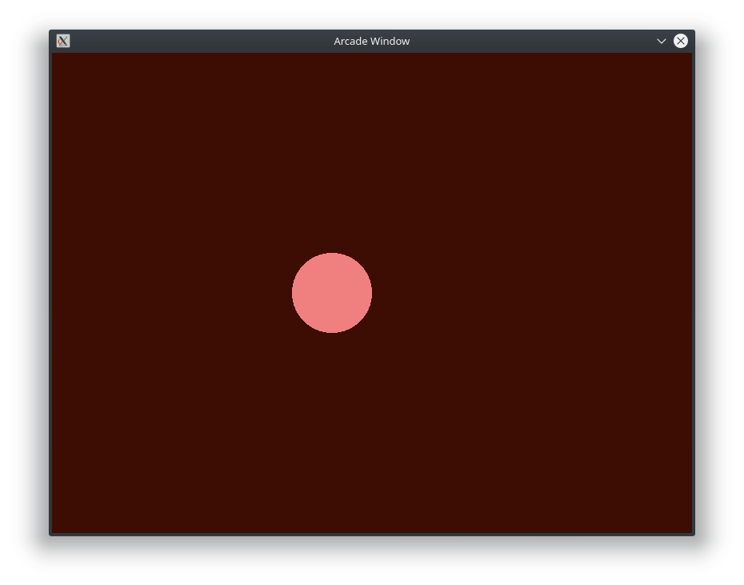
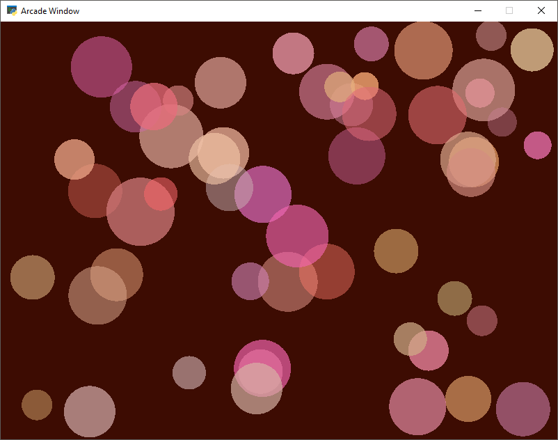

# Animasjon

Vi bygger videre på det vi lærte i [Tilfeldig kunst oppgaven](https://github.com/orsnes-privatskole/python-oppgaver/blob/master/random-art.md). Nå skal vi utvide med å lage bevegelige bilder (animasjon). Basisprinsippet for animasjon er at man tegner mange bilder i rask rekkefølge samtidig som vi endrer på noen parametre (f.eks. posisjon til et objekt) for hvert bilde. Dermed skaper vi inntrykk av at objektet beveger seg.

Koden vår begynner nå å bli mer kompleks, og vi vil derfor ta i bruk klasser og objekter som gjør det lettere å organisere koden. Det gjør det også mulig å basere oss på kode som allerede finnes. For eksempel i [Python Arcade](http://arcade.academy) så finnes det en *klasse* for å håndtere et *vindu* som har kontroll på tegning av grafikk som stadig oppdateres, samt håndtere bruker-input, f.eks at brukere trykker på en tast på tastaturet eller beveger muspekeren.

Dette kan vi dra nytte av ved å lage vår egen klasse som *arver* fra Python Arcade sin [arcade.application.Window](http://arcade.academy/arcade.html?#module-arcade.application). At den arver betyr at vi får med alt som finnes i den klassen fra før, og at vi i tillegg kan lage vår egen kode for hva som skal skje når en tast trykkes f.eks.

## Innhold
- [Del A - Basiskode](#del-a---basiskode)
- [Del B - Bevegelig objekt](#del-b---bevegelig-objekt)
- [Del C - Hastighet](#del-c---hastighet)
- [Del D - Enkel kollisjonsdeteksjon](#del-d---enkel-kollisjonsdeteksjon)
- [Del E - Bevegelse i flere akser](#del-e---bevegelse-i-flere-akser)
- [Del F - Flere objekter](#del-f---flere-objekter)
- [Del G - Flere farger](#del-g---flere-farger)


## Del A - Basiskode

Først lager vi en "basiskode" som gjør klart et lerret som tegnes på nytt og på nytt basert på ``Window`` klassen beskrevet ovenfor. I første omgang vil det bare være et "tomt skall" som vi fyller på funksjonalitet i etterhvert. For funksjoner som ikke er ferdig, så kan vi bruke Python kodeordet ``pass`` for å indikere at "her kommer det mer kode, ikke bry deg med det enda". For et mer komplett eksempel på bruk av ``Window`` klassen, se Python Arcade sin [Starting template](http://arcade.academy/examples/starting_template.html#starting-template)


Kopier koden nedenfor inn i en ny Python fil:

```python
import arcade

SCREEN_WIDTH = 800
SCREEN_HEIGHT = 600


class MyWindow(arcade.Window):

    def __init__(self, width, height):
        super().__init__(width, height)

        arcade.set_background_color(arcade.color.BLACK_BEAN)

    def on_draw(self):
        arcade.start_render()

    def on_update(self, delta_time):
        pass

    def on_key_press(self, key, key_modifiers):
        pass


def main():
    window = MyWindow(SCREEN_WIDTH, SCREEN_HEIGHT)
    arcade.run()


if __name__ == "__main__":
    main()

```

## Del B - Bevegelig objekt



Nå som vi har basiskoden på plass, vil vi lage et nytt objekt som skal bevege seg. Objektet skal holde rede på egen posisjon og fart, samt være istand til å "tegne seg selv".

Vi kaller klassen vår for ``Shape``, og legger følgende kode til over ``MyWindow`` klassen:

```python
class Shape:
    
    def __init__(self, x, y):
        # Object position
        self.x = x
        self.y = y
        
        # Object velocity (speed) 
        self.vel_x = 5
        self.vel_y = 0
        
    def update(self):
        # Calculate new position based on velocity
        self.x += self.vel_x
        self.y += self.vel_y
        
    def draw(self):
        arcade.draw_circle_filled(self.x, self.y, 50, arcade.color.LIGHT_CORAL)
        
```

For å ta i bruk denne klassen, så går vi til ``__init__()`` funksjonen i ``MyWindow`` klassen og oppretter en *instans* av ``Shape`` slik:

```python
# Create a shape object at 0 (left) x position, and centre of height
self.shape = Shape(0, SCREEN_HEIGHT // 2)
```

I tillegg må vi sørge for at det nye objektet blir oppdatert og tegnet for hver gang vinduet tegnes på nytt (frame). Det gjøres i ``MyWindow`` klassen slik:

```python
def on_draw(self):
    arcade.start_render()
    self.shape.draw()

def on_update(self, delta_time):
    self.shape.update()
```

Vi har nå et vindu som animerer en sirkel som beveger seg fra venstre mot høyre med 5 piksler (``vel_x``) for hver gang bildet tegnes på nytt.

## Ekstra utforsking og variasjoner

 1. Hvor fort vil den bevege seg per sekund?
 2. Kan vi få den til å snu når "den møter veggen"?
 3. Hvordan kan vi også bevege den i høyde-retningen (y-aksen)?
 4. Hva med flere objekter?
 
## Del C - Hastighet

Slik vi har laget det nå, så vil hastigheten være basert på hvor fort animasjonen kjøres, antall bilder per sekund (heretter: framerate) multiplisert med størrelsen på variabelen ``vel_x``. Standard i Python Arcade er en framerate (FPS) på 60. Så da får vi:

```
vel_x = 5
fps = 60
Hastighet i piksler per sekund: 5 * 60 = 300 piksler i sekundet
```

Dette er i utgangspunktet greit, men en bedre måte å gjøre det på er å la bevegelsen "fysikken" i en animasjon være uavhengig av antall bilder i sekundet. Dette gjelder særlig i spill, men også i rene animasjoner fordi antall bilder i sekundet kan variere med ytelse på maskin og hvor mye annet maskinen holder på med samtidig. Vi kan teste dette med å endre ønsket framerate i ``main()`` funksjonen:

```python
def main():    
    window = MyWindow(SCREEN_WIDTH, SCREEN_HEIGHT)
    window.set_update_rate(1/10)
    arcade.run()
```

Om vi nå kjører det, så ser vi at objektet beveger seg saktere (og mer hakket). Vi har nå:

```
vel_x = 5
fps = 10
Hastighet i piksler per sekund: 5 * 10 = 50 piksler i sekundet
```

For å få objektet til å bevege seg like langt (antall piksler i sekundet) uavhengig av framerate, så kan vi ta i bruk variabelen ``delta_time`` i funksjonen ``on_update()`` i ``MyWindow`` klassen. Denne variabelen holder rede på hvor lang tid i sekunder som er gått siden forrige gang den ble kalt. På den måten kan vi beregne hvor langt alle objekter skal flytte seg basert på hvor lang tid som er gått siden forrige bilde (frame).

Vi endrer i ``Shape`` klassen, først med å sette ``vel_x`` til 300 siden vi nå kan angi fart i piksler per sekund:

```python
# Object velocity (speed in pixels per second)
self.vel_x = 300
self.vel_y = 0
```

Så må vi legge til ``delta_time`` i ``update()`` funksjonen på ``Shape`` klassen, og ta det i bruk i beregningen av ny posisjon:

```python
def update(self, delta_time):
    # Calculate new position based on velocity
    self.x += self.vel_x * delta_time
    self.y += self.vel_y * delta_time
```

I ``MyWindow`` må vi så sende inn ``delta_time`` når vi kaller ``update()`` på ``Shape`` objektet:

```python
def on_update(self, delta_time):
    self.shape.update(delta_time)
```

Kjører vi det nå, så vil vi se at objektet beveger seg like fort som før vi endret framerate (men mye mer hakkete siden vi har bare 10 FPS). Vi kan endre tilbake til 60 FPS:

```python
window.set_update_rate(1/60)
```

Vi ser at objektet nå beveger seg mye mer mykt, men med samme hastighet fra venstre side av vinduet til høyre.

## Del D - Enkel kollisjonsdeteksjon

Hvis vi sjekker i ``update()`` funksjonen om høyre side av objektet er lik eller større enn ``SCREEN_WIDTH``, så vet vi at vi har nådd kanten av vinduet. For å snu en bevegelse, så kan vi multiplisere fart variabelen (``vel_x``) med -1. På den måten snur vi fortegnet og objektet vil bevege seg i motsatt retning.

På samme måte kan vi sjekke for om venstre side av objektet er lik eller mindre enn 0, da vet vi at objektet har nådd venstre kant.

Siden posisjonen vi har i ``x`` og ``y`` i ``Shape`` representerer senter av objektet, så kan vi lage noen enkle funksjoner for posisjon til høyre og venstre kant er. Det gjør koden lettere å lese og arbeide med senere. Først lag en variabel i ``__init__()`` som holder rede på størrelsen (radius):

```python
# Object position
self.x = x
self.y = y
self.size = 50
```

I ``draw()`` kan vi nå bruke den nye ``size`` variabelen isteden for en hardkodet verdi:

```python
def draw(self):
    arcade.draw_circle_filled(self.x, self.y, self.size, arcade.color.LIGHT_CORAL)
```

Legg så til nye funksjoner ``Shape`` klassen:

```python
def right(self):
    return self.x + self.size

def left(self):
    return self.x - self.size
```

Nå kan vi bruke disse funksjonene i ``update()`` for å beregne om vi skal snu retningen:

```python
# Check if we hit the right wall and still moving right, then flip direction
if self.right() >= SCREEN_WIDTH and self.vel_x > 0:
    self.vel_x *= -1
# Check if we hit the left wall and still moving left, then flip direction
elif self.left() <= 0 and self.vel_x < 0:
    self.vel_x *= -1
```

Det er nå viktig at vi plasserer objektet slik at hele er inne på vinduet, så vi endrer koden i ``MyWindow`` der vi oppretter objektet slik:

```python
# Create a shape object at 0 (left) x position, and centre of height
self.shape = Shape(50, SCREEN_HEIGHT // 2)
```

Når vi nå kjører koden vil objektet bevege seg til høyre, snu og komme tilbake til venstre, så til høyre...

## Del E - Bevegelse i flere akser

Frem til nå, så har vi kun beveget objektet horisontalt. Om vi endrer ``vel_y`` også, så vil objektet bevege seg i Y-aksen. F.eks sett ``vel_y`` til 150:

```python
# Object velocity (speed in pixels per second)
self.vel_x = 300
self.vel_y = 150
```

Kjører vi koden nå ser vi at objektet beveger seg på skrå oppover, men snur ikke lengre... vi må legge til en lignende sjekk for topp og bunn som vi gjorde for høyre og venstre. Legg til funksjoner i ``Shape``:

```python
def top(self):
    return self.y + self.size

def bottom(self):
    return self.y - self.size
```

I tillegg må vi bruke disse nye funksjonene i ``update()`` for å snu retningen på bevegelsen i Y-aksen om vi treffer toppen eller bunnen av vinduet:

```python
# Check if we hit the window top and still are moving up, then flip direction
if self.top() >= SCREEN_HEIGHT and self.vel_y > 0:
    self.vel_y *= -1
# Check if we hit the window bottom, and still are moving down, then flip direction
if self.bottom() <= 0 and self.vel_y < 0:
    self.vel_y *= -1
```

## Del F - Flere objekter

Til nå har vi kanskje ikke sett den store nødvendigheten av at vi laget ``Shape`` som et eget objekt. Det kunne jo relativt enkelt ha vært egne variable i ``MyWindow`` klassen, med f.eks:

```python
self.shape_x = 0
self.shape_y = SCREEN_HEIGHT // 2
```

Men om vi skal ha flere objekter, så begynner det snart å bli en bedre løsning at hvert objekt holder rede på "seg selv". Vi kan endre koden til å lage et nytt objekt hver gang vi trykker på "SPACE" tasten. For å holde rede på objektene bruker vi en liste isteden for en enkel variabel, og for å skape litt mer variasjon lar vi start-posisjonen, størrelsen og farten være tilfeldig.

Vi må nå importere ``random`` modulen på toppen av koden:

```python
import arcade
import random
```

I ``Shape`` sin ``__init__()`` funksjon lar vi fart og størrelse bli satt tilfeldig:

```python
def __init__(self, x, y):
    # Object position
    self.x = x
    self.y = y
    self.size = random.randint(20, 50)

    # Object velocity (speed in pixels per second)
    self.vel_x = random.randint(-300, 300)
    self.vel_y = random.randint(-300, 300)
``` 

I ``MyWindow`` klassen der vi oppretter ``Shape`` objektet, endrer vi til å bare opprette en tom liste:

```python
# Create an empty list of shapes
self.shapes = []
 ```

 Så må vi endre i ``on_update()`` og ``on_draw()`` så vi går gjennom listen og oppdaterer alle objekter som er i listen og ikke bare et enkelt objekt:

 ```python
def on_draw(self):
    arcade.start_render()
    
    for shape in self.shapes:
        shape.draw()

def on_update(self, delta_time):
    for shape in self.shapes:
        shape.update(delta_time)
```

Til slutt tar vi i bruk ``on_key_press()`` funksjonen i ``MyWindow``. Først sjekker vi om det er SPACE som er trykket ned, og i så fall, lager vi et nytt objekt på et tilfeldig sted:

```python
def on_key_press(self, key, key_modifiers):
    if key == arcade.key.SPACE:
        # Create random start position
        random_x = random.randint(0, SCREEN_WIDTH)
        random_y = random.randint(0, SCREEN_HEIGHT)
        
        # Create new shape
        shape = Shape(random_x, random_y)
        
        # Add the new shape to the list
        self.shapes.append(shape) 
```

Når vi nå kjører koden starter vi med ingen objekter som beveger seg. For hver gang vi trykker SPACE legges det til et nytt objekt. Prøv å legg til mange og tenk på hvordan koden måtte vært om vi ikke kunne ha organisert det som klasser og objekter...

## Del G - Flere farger

Et annet eksempel på hvordan vi kan dra nytte av at hvert objekt "vet noe om seg selv" er å la hvert objekt få en tilfeldig farge ved opprettelsen.

I ``__init__()`` funksjonen til ``Shape`` kan vi legge til følgende:

```python
# Find random color for this object
red = random.randint(200, 255)
green = random.randint(100, 255)
blue = random.randint(100, 255)
alpha = random.randint(100, 200)
self.color = (red, green, blue, alpha)
```

Her lar vi rød få en større verdi enn de andre farge-kanalene, samt at alpha-kanalen (gjennomsiktighet) alltid sørger for litt gjennomsiktighet, men aldre helt gjennomsiktig.

I tillegg må vi endre i ``draw()`` funksjonen så vi bruker den nye ``self.color`` variabelen:

```python
def draw(self):
    arcade.draw_circle_filled(self.x, self.y, self.size, self.color)
```

