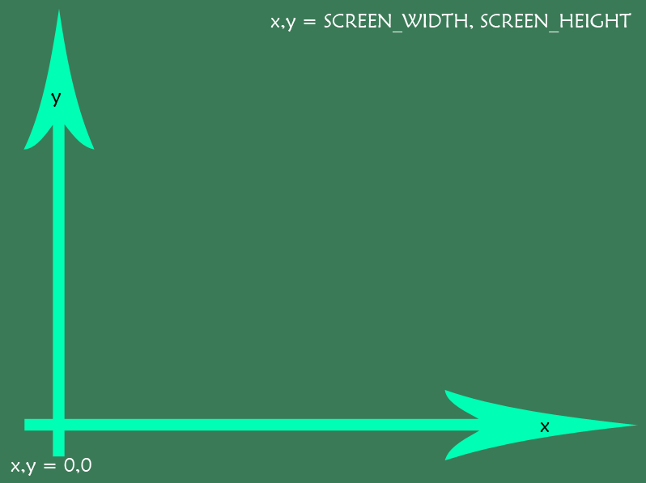

# Tilfelding kunst med Python Arcade

Vi skal nå bruke [Python Arcade](http://arcade.academy) for å gå over fra tekstbasert Python, til også å kunne tegne grafikk med piksler og farger. Første prosjekt er å bruke Python til å lage *tilfeldig kunst*, hvor vi bruker ``random`` modulen i Python til å velge egenskaper som påvirker kunsten vår.

Forutsetter at vi har installert Python Arcade, det kan gjøres fra PyCharm eller kommandolinjen med:

```
pip install arcade
```

Alternativt se dokumentasjon her: [http://arcade.academy/installation.html](http://arcade.academy/installation.html)

## Del A - Gjør klar lerret

Først lager vi oss et vindu med et "lerret" (engelsk: canvas) som vi kan tegne på.

```python
# We are using the arcade library. See http://arcade.academy/ for documentation
import arcade
import random  # We want to use random for a new art image each time

# Create a window with 640 pixels width and 400 pixels height
SCREEN_WIDTH = 640
SCREEN_HEIGHT = 400
arcade.open_window(SCREEN_WIDTH, SCREEN_HEIGHT, "My Random Art")

# Use white canvas, see possible colors here: http://arcade.academy/arcade.color.html
arcade.set_background_color(arcade.color.WHITE)

# Start the render process. This must be done before any drawing commands.
arcade.start_render()

arcade.finish_render()  # Need this to put the drawing to the screen

arcade.run()  # This keep the window open until closed by the user
```

Denne koden vil gi oss et hvitt vindu med 640x400 piksler. Ikke spesielt spennende foreløpig :), neste del vil vi begynne å lage kunst.

## Del B - Tilfeldige firkanter

Når vi skal tegne med Python Arcade, så er det viktig vite at koordinat-systemet som brukes er basert på at koordinat ``0,0`` er nede i venstre hjørne. X-aksen øker mot høyre, og Y-aksen øker oppover. Så koordinaten ``SCREEN_WIDTH,SCREEN_HEIGHT`` betyr punktet lengst oppe til høyre i vinduet.



Det første vi vil tegne, er 60 røde firkanter, plassert et tilfeldig sted på lerretet. Vi kan fortsette fra koden i Del A, med å legge inn tegne-koden mellom linjene ``arcade.start_render()`` og ``arcade.finish_render()``.

Bruk en løkke for å gjøre det samme 60 ganger, og funksjonen ``arcade.draw_point(x, y, arcade.color.RED, 10)`` for å tegne. 

<details>
<summary>Løsningsforslag - Del B</summary>

```python
# We are using the arcade library. See http://arcade.academy/ for documentation
import arcade
import random  # We want to use random for a new art image each time

# Create a window with 640 pixels width and 400 pixels height
WIDTH = 640
HEIGHT = 400
arcade.open_window(WIDTH, HEIGHT, "My Random Art")

# Use white canvas, see possible colors here: http://arcade.academy/arcade.color.html
arcade.set_background_color(arcade.color.WHITE)

# Start the render process. This must be done before any drawing commands.
arcade.start_render()

# Draw red dots in a random position, inside the window
number_of_dots = 60
for i in range(0, number_of_dots):
    x = random.randint(0, WIDTH)
    y = random.randint(0, HEIGHT)
    arcade.draw_point(x, y, arcade.color.RED, 10)

arcade.finish_render()  # Need this to put the drawing to the screen

arcade.run()  # This keep the window open until closed by the user


```
</details>

## Del C - Mer tilfeldighet - farger

For å skape mer variasjon i kunstverket kan vil lage tilfeldig farge på hver firkant isteden for at alle er røde. En vanlig måte å beskrive en farge på en datamaskin er med tre tall som beskriver fargekanalene rød (R), grønn (G) og blå (B). På en vanlig PC i dag, så har hver kanal en verdi fra 0 til 255 (8-bits). Med tre kanaler får vi 3 * 8 altså 24 bits farge. I tillegg finnes det en "Alfa-kanal" som beskriver gjennomsiktighet. Den er også 8-bit (0 til 255), så da blir det 8 * 4 = 32 bits farge.

For å lage en tilfeldig farge kan vi bruke 4 variabler, som vi lar bli et tilfeldig tall mellom 0 og 255:

```python
red = random.randint(0, 255)
green = random.randint(0, 255)
blue = random.randint(0, 255)
alpha = random.randint(0, 255)

color = (red, green, blue, alpha)
```

<details>
<summary>Løsningsforslag - Del C</summary>

```python
# We are using the arcade library. See http://arcade.academy/ for documentation
import arcade
import random  # We want to use random for a new art image each time

# Create a window with 640 pixels width and 400 pixels height
WIDTH = 640
HEIGHT = 400
arcade.open_window(WIDTH, HEIGHT, "My Random Art")

# Use white canvas, see possible colors here: http://arcade.academy/arcade.color.html
arcade.set_background_color(arcade.color.WHITE)

# Start the render process. This must be done before any drawing commands.
arcade.start_render()

# Draw dots in a random position with a random color, inside the window
number_of_dots = 60
for i in range(0, number_of_dots):
    x = random.randint(0, WIDTH)
    y = random.randint(0, HEIGHT)

    red = random.randint(0, 255)
    green = random.randint(0, 255)
    blue = random.randint(0, 255)
    alpha = random.randint(0, 255)

    color = (red, green, blue, alpha)

    arcade.draw_point(x, y, color, 10)

arcade.finish_render()  # Need this to put the drawing to the screen

arcade.run()  # This keep the window open until closed by the user

```

</details>