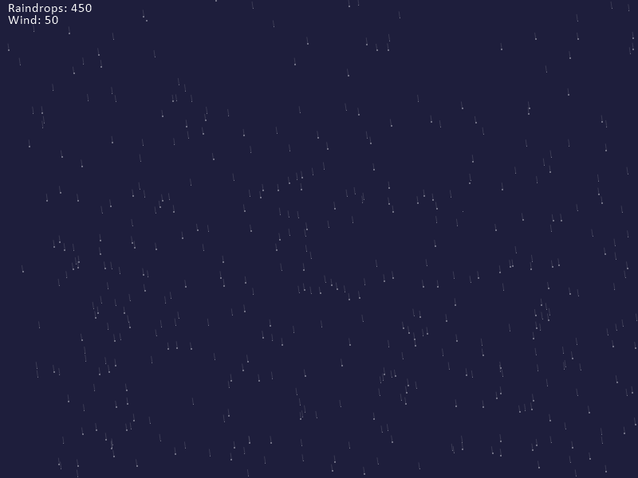
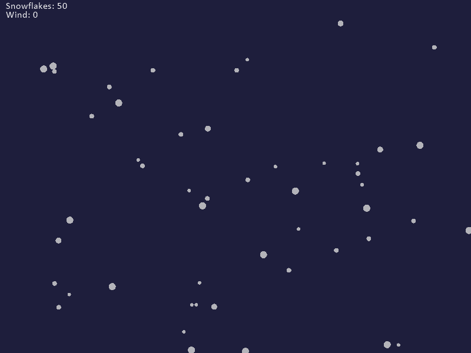

# Vær simulering med Python Arcade

Vi bygger videre på det vi lærte i [Animasjon](https://github.com/orsnes-privatskole/python-oppgaver/blob/master/animation.md) oppgaven hvor vi laget animerte objekter for å lage en animasjon av vær-effekter som regn og snø.

## Innhold

## Del A - Basiskode

Vi baserer oss på samme basis-kode som i forrige oppgave, men velger en mørk grå bakgrunn siden dette skal være en regntung dag.

Kopier koden nedenfor inn i en ny Python fil:

```python
import arcade

SCREEN_WIDTH = 800
SCREEN_HEIGHT = 600


class MyWindow(arcade.Window):

    def __init__(self, width, height):
        super().__init__(width, height)

        background_color = (50, 50, 60)
        arcade.set_background_color(background_color)

    def on_draw(self):
        arcade.start_render()

    def on_update(self, delta_time):
        pass

    def on_key_press(self, key, key_modifiers):
        pass


def main():
    window = MyWindow(SCREEN_WIDTH, SCREEN_HEIGHT)
    arcade.run()


if __name__ == "__main__":
    main()
```

## Del B - En regndråpe

Vi modellerer en regndråpe som et *objekt*, på samme måte som vi gjorde i animasjons oppgaven tidligere. Se på det eksemplet og kopier eventuelt over klassen ``Shape`` og tilpass den til å bli en regndråpe.

- Hva må endres?
- Hvilke egenskaper å en regndråpe ha?

Plasser regndråpen i toppen av vinduet og animer at den faller mot bakken, når den har truffet bakken starter den på toppen igjen.

Tips: Bruk den forbedrede ``update()`` metoden fra animasjons oppgaven som også tar hensyn til ``delta_time``.

Tips: For at dråpen skal falle mot bakken må variabelen ``vel_y`` ha en verdi mindre enn 0, f.eks -100.

## Del C - Flere regndråper

Når vi har definert en regndråpe, så er det mulig å lage en hel regnskur med å lage mange *instanser* av regndråpe objektet. Plasser regndråpene i tilfeldig tilfeldig posisjon fylles med regndråper i hele vinduet. Start med 50 dråper.

Tips: bruk en [Python liste](https://orsnes-privatskole.github.io/#lister) til å holde orden på alle dråpene.

## Del D - Gjør det interaktivt

Bygg inn interaktivitet med å la brukeren kunne trykke på tastene + og - for å øke og redusere mengden med regn.

Tips: Lag to funksjoner, en for å legge til et antall dråper, og en for å ta bort et antall dråper, f.eks:

```python
def add_raindrops(self, number_of_drops):
    # Add code for adding raindrops here

def remove_raindrops(self, number_of_drops):
    # Add code for removing raindrops here  
```

Idé: Legg til en tekst som forteller hvor mange regndråper som er på skjermen.

## Del E - Legg til vind

Regnet faller jo sjelden rett ned (i hvert fall i Nord-Norge!). Legg til vind som en faktor som påvirker regndråpene. Brukeren kan for eksempel styre vind-retning og mengde med piltast til høyre og venstre.

Tips: Legg til en tekst på skjermen (eller en vind-pil) som viser hva slags vind som er i øyeblikket.

Tips: Vi bruker variabelen ``val_y`` for å få regnet til å bevege seg mot bakken (tyngdekraft). Vind kan legges inn i variabelen ``val_x`` som vil påvirke regnets bevegelse i x-aksen.

## Del F - Legg til "motion blur"



En måte å få bedre følelse med farten i noe som beveger seg, er å tegne et strek fra nåværende posisjon tilbake til forrige posisjon for hver frame. For å få det til kan vi legge til to variable i regndråpe objektet for forrige x og forrige y posision. I tegn funskjonen legger vi til tegning av en linje fra x,y til forrige x,y i tillegg til selve dråpen.

Denne effekten blir enda mer tydelig om vi lager variabel hastighet nedover i tillegg til vind, det kan vi for eksempel styre med pil-tastene opp og ned for å senke og øke hastigheten på hvordan regnet faller.

Eksempel:
```python
def draw(self):
    arcade.draw_line(self.x, self.y, self.prev_x, self.prev_y, (80, 80, 80, 160))
    arcade.draw_point(self.x, self.y, arcade.color.LIGHT_GRAY, 2)
```

## Del G - La dråpene ha litt ulik størrelse og hastighet basert på størrelse

Om vi lar størrelsen være tilfeldig, og baserer hastigheten mot jorden være høyere for dråper som er større, vil regnet kanskje se enda mer realistisk ut?

## Del H - Legg til snø



Ved å lage en ny klasse i tillegg til ``Raindrop`` så kan vi bygge inn lignende, men annerledes animasjon om det er snø isteden, f.eks. at et snøflak svinger fra side til side mens det faller mot bakken.

